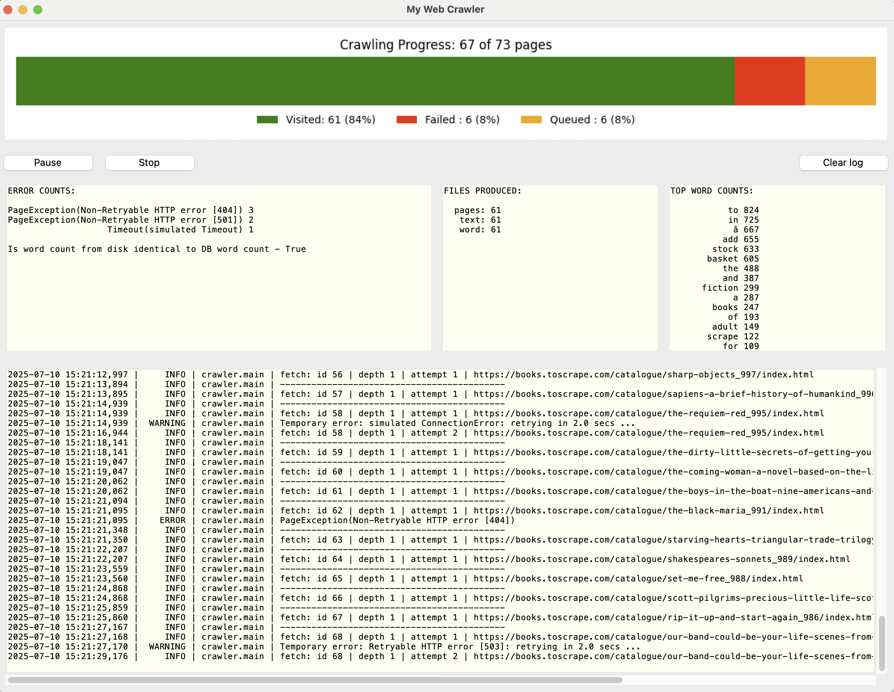

# Web Crawler project

## run Web Crawler:

* Create a new conda environment:\
  `conda create -n crawler python=3.13 -y`
* Activate the conda environment:\
  `conda activate crawler`
* Install dependencies using pip from your requirements.txt:\
  `pip install -r requirements.txt`
* Run the Crawler:
  - UI: `python crawler_ui.py`
  - CLI: `python crawler.py`

#### to delete the conda environment:
  - `conda deactivate`
  - `conda remove --name crawler --all -y`

## UI screenshot:

## Architecture

### Crawl Strategy

The crawler uses a breadth-first search (BFS) approach to traverse the website hierarchy. BFS was chosen over depth-first search (DFS) because it allows the crawler to process all pages at the current depth before moving deeper. This approach improves page turnover speed, enabling faster discovery and processing of new pages. Additionally, BFS helps limit memory usage by avoiding deep recursive paths, making the crawling process more efficient and scalable.

### Crawler State Management

The crawler maintains its state in a **SQLite database**, allowing it to persist progress between runs, recover from crashes, and avoid reprocessing the same URLs.

#### Tables

- **`pages`**: Tracks every URL discovered by the crawler, along with metadata:

  - `url`, `depth`: Used to control crawl order (BFS).
  - `status`: Can be `'queued'`, `'visited'`, or `'failed'`.
  - `attempts`, `last_attempt`: Support retry logic and tracking.
  - `error`: Stores failure reasons for diagnostics.
- **`words`**: Stores the global word frequency counts aggregated across visited pages.

#### Behavior

- URLs are enqueued only once to avoid duplicate processing using INSERT OR IGNORE
- The crawl order is managed using a **breadth-first search (BFS)** strategy,
  prioritizing the shallowest unvisited URL.
- Retry logic tracks and limits repeated failures, with support for controlled retries.
- Word counts are updated incrementally, preserving global frequency data across runs.
- The database uses **Write-Ahead Logging (WAL)** mode for better concurrency and recovery.
- All state operations are managed through the `CrawlerState` class, which:
  - Wraps all database access in a consistent, safe interface.
  - Supports use as a context manager to ensure clean connection handling.
  - The UI manages its own, direct DB connections (read-only).

This approach ensures the crawler is **robust**, **restartable**, and **memory-efficient** when processing large-scale web content.

### Process Locking

To ensure that only one instance of the crawler operates on a given dataset, the system uses a **file-based locking mechanism** via the `LockFile` utility class.
This prevents concurrent processes from interfering with shared resources like the database, text output, or logs.

The lock is specific to the configured **working directory**. That means:
- **Only one crawler instance can run per working directory**.
- **Multiple independent crawler instances** can run in parallel, as long as each uses a separate `WORKDIR`.

This mechanism ensures safe, singleton operation **per crawl session**, while supporting concurrent execution across separate targets.

## UI
some explanations about the UI ...

## Limitations

* Currently limited to processing documents with a *Content-Type* header of either *text/html* or *text/plain*.
* Currently, if the crawler is restarted midway with a different starting URL while retaining the existing workdir content, the state and content may become inconsistent or corrupted. This behavior should be disabled to prevent such cases.
* Consider naming the workdir based on the domain or starting URL (optionally including a timestamp and max_depth) to improve organization and traceability. While this helps distinguish between different crawl sessions, the design should still allow for safe restarts using the same workdir to continue interrupted work without data loss or inconsistency.

## Improvements

* Implement support for parsing and respecting robots.txt directives to ensure compliant and ethical crawling behavior (https://en.wikipedia.org/wiki/Robots.txt).
* Multithreading - Although multithreading is not strictly necessary for the crawler’s purpose—especially since aggressive crawling can trigger rate limits or blacklisting—it may still be worthwhile to implement safe parallel processing as an exercise. This would provide a useful learning opportunity and lay the groundwork for future scalability, while still respecting polite crawling behavior.
