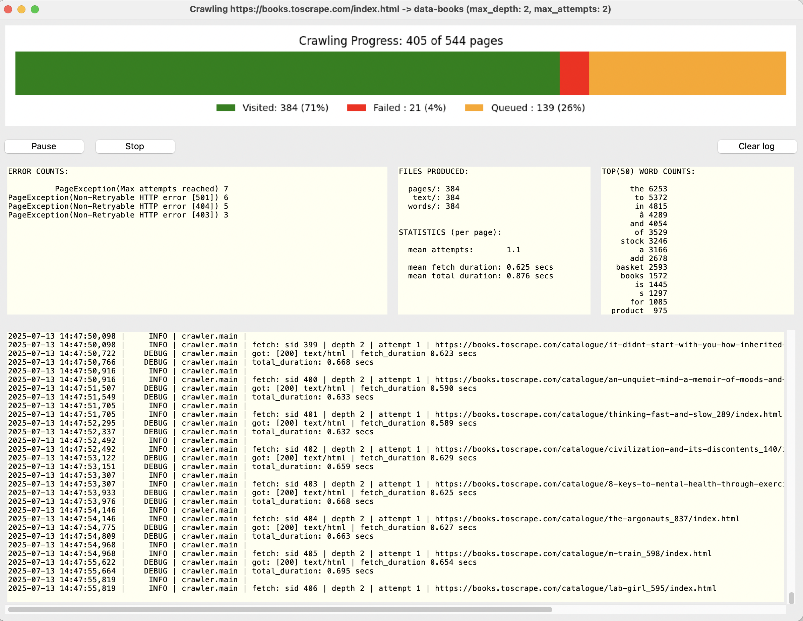

# Web Crawler project
Implementation of a basic web crawler capable of retrieving and analyzing text content from web pages.
The main goal is to count the instances of each word in the text retrieved from web pages.


## How to run:

* Install miniconda3, follow steps in:\
  https://www.anaconda.com/docs/getting-started/miniconda/install
* Create a new conda environment:\
  `conda create -n crawler python=3.13 -y`
* Activate the conda environment:\
  `conda activate crawler`
* Install dependencies using pip from requirements.txt:\
  `pip install -r requirements.txt`
* Usage:
```
  python crawler.py [-d DEPTH] [-no-ui] url workdir

  positional arguments:
    url          Starting point and scope for the crawler.
    workdir      Working directory, for output and state.

  options:
    -d           Max crawl depth (default: 1)
    -a           Max allowed attempts (default: 2)
    -e           Enable random error injection (testing)
    -no-ui       Run in non-UI mode (headless)
```
* Run examples:
```bash
  python crawler.py https://quotes.toscrape.com ./data-quotes -d 2
  python crawler.py https://books.toscrape.com/index.html data-books -d 2 -a 3
```

* By default crawler starts in UI mode, for CLI mode use `--no-ui` flag

* Outcomes\
After the crawl completes, the following output files and directories will be generated in the working directory:

  - **Original HTML pages**  
  Stored in: `<workdir>/pages/`  
  Contains the raw HTML content of all crawled pages.

  - **Plain text versions**  
  Stored in: `<workdir>/text/`  
  Each file contains the extracted visible text from its corresponding HTML page.

  - **Aggregated word counts**  
  Stored in: `<workdir>/word_counts.json`  
  A JSON dictionary of total word frequencies across all crawled pages, in the format:
    ```json
    {
      "hello": 12,
      "world": 7
    }
    ```
    The words are sorted by descending count.

  - **Crawl report summary**  
  Stored in: `<workdir>/report.txt`  
  Report file contains a complete summary of a web crawling session, including:
    -	Crawl parameters
    -	Progress statistics (pages downloaded, failed, or pending)
    -	Output file counts by type
    -	Performance metrics
    -	Error counts and messages, if any
    -	Top(50) word frequencies extracted from the crawled pages
  
    see sample report at [doc/sample/report.txt](doc/sample/report.txt)

#### to delete the conda environment:
  - `conda deactivate`
  - `conda remove --name crawler --all -y`

## UI:


A simple UI for real-time tracking of crawl progress, errors, statistics, and logs.
It presents the same information found in report.txt, but in a graphical and live-updating format.

## Architecture

### Crawl Strategy

The crawler uses a breadth-first search (BFS) approach to traverse the website hierarchy. BFS was chosen over depth-first search (DFS) because it allows the crawler to process all pages at the current depth before moving deeper. This approach improves page turnover speed, enabling faster discovery and processing of new pages. Additionally, BFS helps limit memory usage by avoiding deep recursive paths, making the crawling process more efficient and scalable.

### Data Flow
TBD

### Crawler State Management

The crawler maintains its state in a **SQLite database**, allowing it to persist progress between runs, recover from crashes, and avoid reprocessing the same URLs.

#### Tables

- **`pages`**: Tracks every URL discovered by the crawler, along with metadata:

  - `url`, `depth`: Used to control crawl order (BFS).
  - `status`: Can be `'queued'`, `'visited'`, or `'failed'`.
  - `attempts`, `last_attempt`: Support retry logic and tracking.
  - `error`: Stores failure reasons for diagnostics.
- **`words`**: Stores the global word frequency counts aggregated across visited pages.

#### Behavior

- URLs are enqueued only once to avoid duplicate processing using INSERT OR IGNORE
- The crawl order is managed using a **breadth-first search (BFS)** strategy,
  prioritizing the shallowest unvisited URL.
- Retry logic tracks and limits repeated failures, with support for controlled retries.
- Word counts are updated incrementally, preserving global frequency data across runs.
- The database uses **Write-Ahead Logging (WAL)** mode for better concurrency and recovery.
- All state operations are managed through the `CrawlerState` class, which:
  - Wraps all database access in a consistent, safe interface.
  - Supports use as a context manager to ensure clean connection handling.
  - The UI manages its own, direct DB connections (read-only).

This approach ensures the crawler is **robust**, **restartable**, and **memory-efficient** when processing large-scale web content.

### Crawl Session Persistence and Parameter Locking

Once the crawl has been initiated with a specific url, workdir, and depth, these parameters become locked for that working directory. \
Specifically:
-	The program saves the url and depth settings in the workdir when the crawl starts.
-	If you re-run the program with the same workdir, it will resume the previous session using the originally saved url and depth, regardless of what is specified on the command line.
-	You cannot change the url or depth for an existing workdir. 
- **To start a new crawl with different settings, specify a new or empty workdir.**

This design ensures that crawling progress can be paused and resumed safely without risking data inconsistency.


### Process Locking

To ensure that only one instance of the crawler operates on a given dataset, the system uses a **file-based locking mechanism** via the `LockFile` utility class.
This prevents concurrent processes from interfering with shared resources like the database, text output, or logs.

The lock is specific to the configured **working directory**. That means:
- **Only one crawler instance can run per working directory**.
- **Multiple independent crawler instances** can run in parallel, as long as each uses a separate `WORKDIR`.

This mechanism ensures safe, singleton operation **per crawl session**, while supporting concurrent execution across separate targets.

### Testing and Error Injection

To test robustness and error handling, the crawler includes controlled random error injections.
This feature is enabled via the `-e` command-line flag.

When error injection is active, the system may randomly simulate:
- Network errors (`ConnectionError`, `Timeout`)
- HTTP error responses with random status codes
- Page parsing failures
- File write errors (e.g., `FileNotFoundError`, disk full)

These simulations help verify that retries, fallbacks, and logging behave correctly under failure conditions.

## UI
some explanations about the UI ...

## Limitations

* Currently limited to processing documents with a *Content-Type* header of either *text/html* or *text/plain*.
* Basic Word Extraction: Currently, the crawler uses a simple rule to extract words - any sequence of letters, digits, or underscores separated by spaces or punctuation. This will include hashes, special symbols, etc.

## Improvements

* Implement support for parsing and respecting robots.txt directives to ensure compliant and ethical crawling behavior (https://en.wikipedia.org/wiki/Robots.txt).
* Multithreading - Although multithreading is not strictly necessary for the crawler’s purpose—especially since aggressive crawling can trigger rate limits or blacklisting—it may still be worthwhile to implement safe parallel processing as an exercise. This would provide a useful learning opportunity and lay the groundwork for future scalability, while still respecting polite crawling behavior.
* Consider parsing and extracting text from other types (e.g., PDFs).
* Word Extraction Improvements
	- Use more sophisticated tokenization (e.g., nltk or spaCy) for better word extraction.
	- Filter out stop words and apply stemming or lemmatization for cleaner data.
* Implement proper unit tests.
